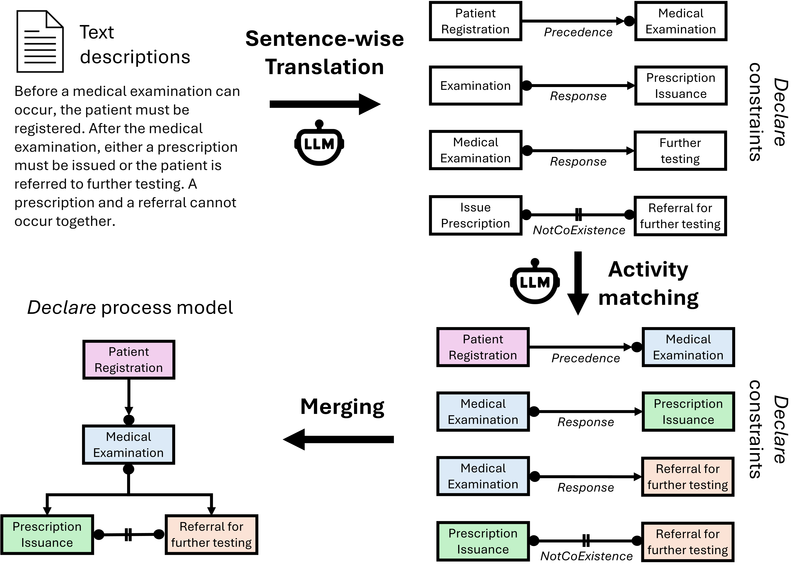

# Natural Language to Declare

This project supports the automated extraction of Declare constraints from natural language texts using fine-tuned Large Language Models (LLMs). Two main features are supported:
- Fine-tuning a user-provided LLM with gold standard Declare constraints
- Computing various metrics to evaluate the quality of extracted Declare constraints



# 1. Fine-Tuning a LLM 

The Jupyter Notebook file (`fine_tuning/nl2declare_finetuning.ipynb`) provides a step-by-step guide to fine-tune a decoder-only Language Model (LLM) like Google's Gemma 7b to extract Declare constraints from natural language sentences. The fine-tuned model can then be used to predict constraints given new sentences.

## Prerequisites

- Python 3.9
- Jupyter Notebook
- Necessary Python packages (specified in the notebook)
- Hugging Face API token to access the pre-trained model (https://huggingface.co/docs/hub/security-tokens)
- `path/to/data_collection.csv`: Placeholder for the data collection that is used for training and testing the model. It should be a CSV file consisting of two colums: The first column is called 'Text Description' and contains the natural language sentences. The second column is called 'Declare Constraint' and contains the gold standard Declare constraint for each sentence. The default data collection is provided at `data/data_collection.csv`.
- Hardware Requirements: A CUDA-compatible GPU with at least 16 GB of memory (models like google/gemma-7b typically require GPUs with at least 16 GB of memory).


## Usage

- Ensure `path/to/data_collection.csv` contains the sentences and corresponding Declare constraints.
- Open nl2declare_finetuning.ipynb in Jupyter Notebook or JupyterLab.
- Follow the steps and execute each cell sequentially. The notebook contains commands to load the pretrained model, create a training and test data set, specify configurations for the fine-tuning process, and finally use the fine-tuned model for inference on the test data set. Optionally, the user can store the fine-tuned model locally.
- After obtaining the predicted constraints for the test data set, use the constraint_evaluator.py to evaluate the performance of the fine-tuned model. The notebook helps you to store csv files for the ground truth constraints and the predicted constraints for the test data set which can be used as input for the constraint evaluator.


# 2. Evaluating Extracted Declare Constraints

The script (`evaluation/constraint_evaluator.py`) evaluates the correctness of constraints found in text against a ground truth set of constraints. It calculates precision, recall, and F1 score for the constraints. It prints all the sentences and corresponding found and ground truth constraints for which an incorrect Declare template was predicted (template error).

## Usage

1. **Prepare the Input Files:**
   - Ensure you have two CSV files: one for the ground truth constraints (e.g., `evaluation/ground_truth.csv`) and one for the found constraints (e.g., `evaluation/found_results.csv`).
   - The format of the CSV files should be as follows:
     - The first column contains the sentences.
     - The second column contains the constraints.

2. **Update the File Paths and Parameters:**
   - Open the `constraint_evaluator.py` file.
   - Replace the placeholders for the input files with the actual paths to your CSV files:
     ```python
     GROUND_TRUTH_FILE = 'path/to/ground_truth.csv'
     FOUND_FILE = 'path/to/found_results.csv'
     ```
   - Adjust the `ALPHA` coefficient if necessary. The `ALPHA` coefficient determines how much the template slot should be weighted. The higher the `ALPHA`, the smaller the penalty for activity errors:
     ```python
     ALPHA = 2  
     ```

3. **Run the Script:**
   - Execute the script to evaluate the constraints:
     ```bash
     python constraint_evaluator.py
     ```

4. **Output:**
   - The script will print the overall precision, recall, and F1 score.
   - It will also print the number of sentences/constraints in the test dataset and the number of template errors.
   - It will print the sentences for which a template error is discovered.

## Example

The following files are examples for how the CSV files for evaluation should look like:

`evaluation/ground_truth.csv`
`evaluation/found_results.csv`

# Data Collection 

`data/data_collection.csv` contains the complete data collection of natural language sentences paired with human-checked gold standard Declare constraints that was employed for training and evaluation. `data/internal_validation` and `data/external_validation` contain training, test, and result datasets specific to the various validation settings in the paper.
